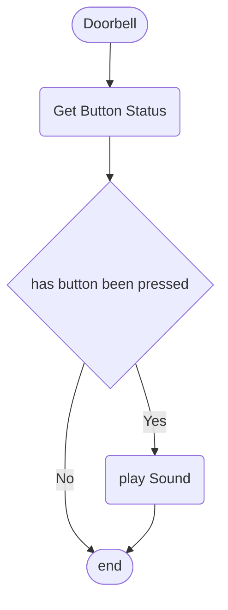
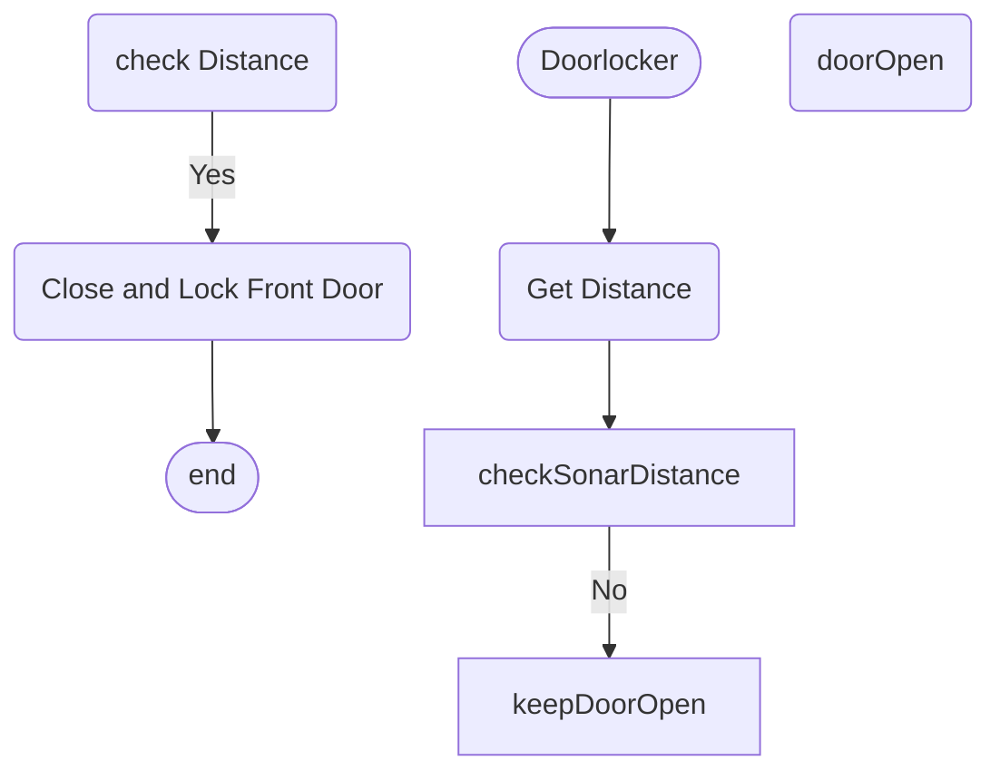
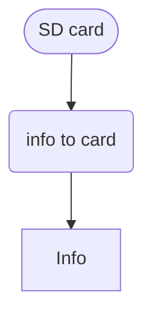

# Programming Logic

> For each behaviour, create the mermaid flowchart. Start each flowchart with a Heading naming the functionality. Delete this comment prior to submission.

## Doorbell


## Door locker

##   Logic 3



## Logic 4
```mermaid
flowchart TD
   start([PIR])
    Start(PIR) -->
    Checking(check for Infared) -->
    Infared(alarm)-->|yes| flash lights on 
```

## Logic 5
```mermaid 
flowchart TD
    Start([PIR])
    GetPIRStatus(Get PIR Status)
    CheckPIR{Has Infared been detected}
    SoundAlarm(Turn Lights On)
    finish([end])
    
    Start-->GetPIRstatus-->CheckPIR
    CheckPIR-->|Yes| SoundAlarm
    CheckPIR-->|No| finish
    SoundAlarm-->finish    
